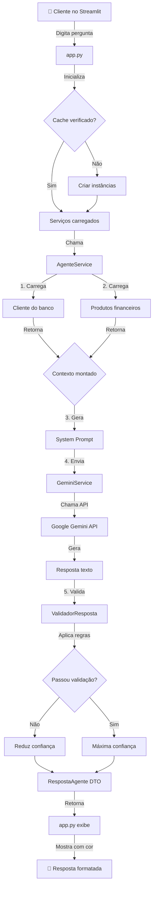
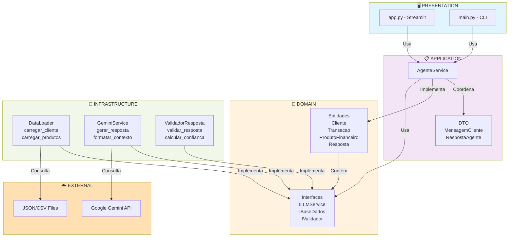
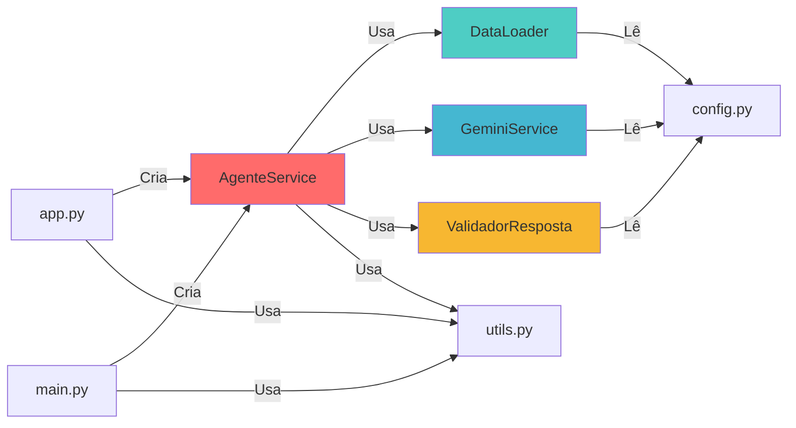
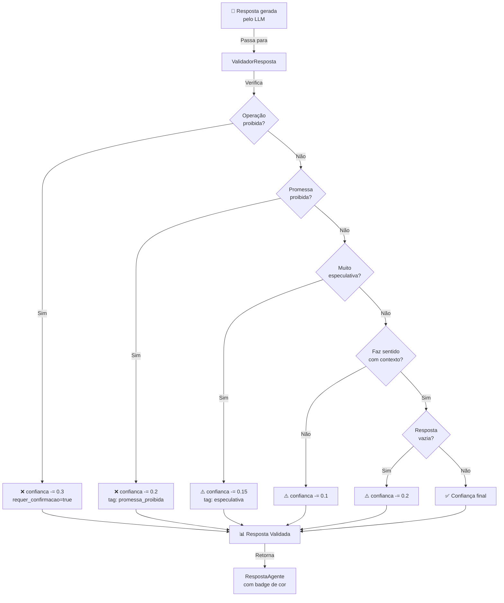
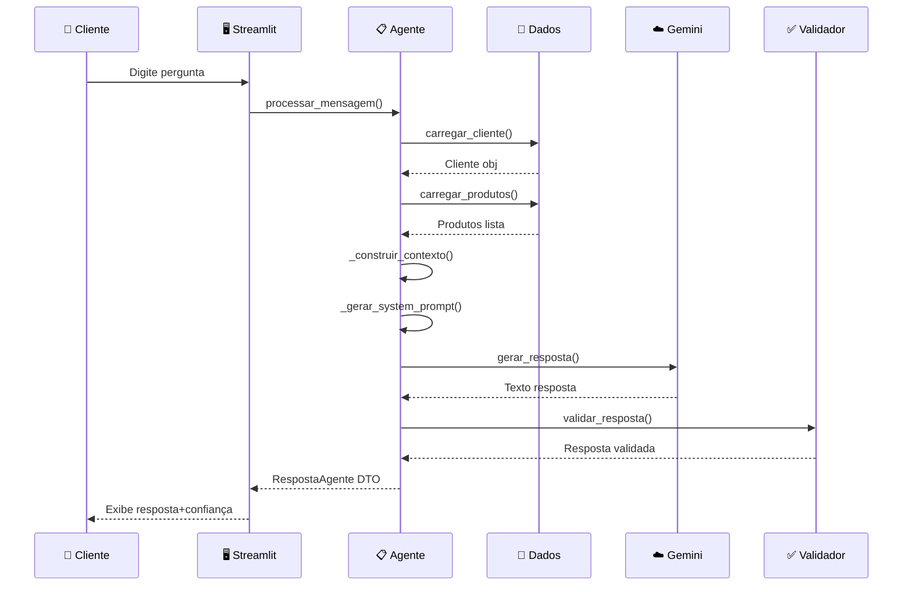
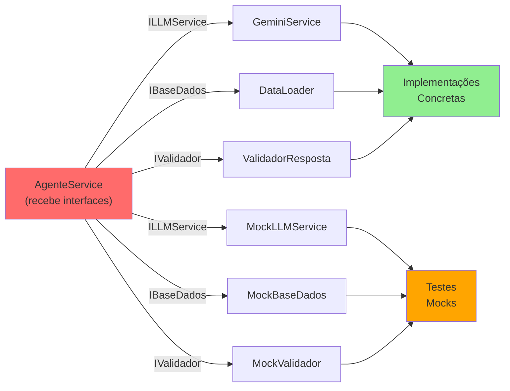
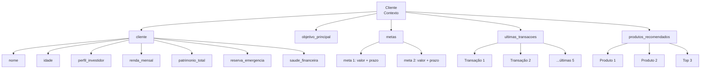

# === ARCHITECTURE_DIAGRAM.md ===
# Diagramas Visuais da Arquitetura ABI

## 🔄 Fluxo Completo de Processamento



## 🏛️ Arquitetura em Camadas



## 📊 Dependências de Componentes



## 🔐 Fluxo de Validação



## 📈 Lifecycle do Cliente



## 🎯 Injeção de Dependência



## 📊 Contexto do Cliente (Estrutura de Dados)



## 🔐 Camadas de Segurança

```
┌─────────────────────────────────────────────────────────┐
│ 1️⃣ PROMPT DO SISTEMA                                    │
│    ✗ Não execute transações                             │
│    ✗ Não faça promessas de retorno garantido            │
│    ✗ Admita limitações                                  │
└──────────────────┬──────────────────────────────────────┘
                   ↓
┌─────────────────────────────────────────────────────────┐
│ 2️⃣ RESPOSTA DO LLM (Google Gemini)                      │
│    Segue instruções do system prompt                     │
└──────────────────┬──────────────────────────────────────┘
                   ↓
┌─────────────────────────────────────────────────────────┐
│ 3️⃣ VALIDADOR - Detecta Risco                           │
│    ✅ Operações proibidas                              │
│    ✅ Promessas não permitidas                         │
│    ✅ Respostas especulativas                          │
│    ✅ Consistência com contexto                        │
└──────────────────┬──────────────────────────────────────┘
                   ↓
┌─────────────────────────────────────────────────────────┐
│ 4️⃣ CONFIANÇA (0-100%) - Penalizações aplicadas        │
│    -30% = Operação proibida                             │
│    -20% = Promessa proibida                             │
│    -15% = Muito especulativa                            │
│    -10% = Inconsistente                                 │
└──────────────────┬──────────────────────────────────────┘
                   ↓
┌─────────────────────────────────────────────────────────┐
│ 5️⃣ INTERFACE                                            │
│    Exibe com badges de cor:                             │
│    🟢 Verde (>80%): Alta confiança                     │
│    🟡 Amarelo (50-80%): Média confiança                │
│    🔴 Vermelho (<50%): Baixa confiança                 │
│    ⚠️ Aviso se requer_confirmacao=true                 │
└─────────────────────────────────────────────────────────┘
```

## 📂 Estrutura de Diretórios

```
abi-agente/
├── src/                           # Código-fonte
│   ├── domain/
│   │   ├── __init__.py
│   │   ├── entities.py            # ✅ Cliente, Transacao, etc
│   │   └── interfaces.py          # ✅ ILLMService, IBaseDados
│   ├── application/
│   │   ├── __init__.py
│   │   ├── services.py            # ✅ AgenteService
│   │   └── dto.py                 # ✅ MensagemCliente, RespostaAgente
│   ├── infrastructure/
│   │   ├── __init__.py
│   │   ├── data_loader.py         # ✅ DataLoader
│   │   ├── gemini_service.py      # ✅ GeminiService
│   │   └── validador.py           # ✅ ValidadorResposta
│   ├── config.py                  # ✅ Configurações
│   ├── utils.py                   # ✅ Logging
│   ├── app.py                     # ✅ Streamlit UI
│   ├── main.py                    # ✅ CLI
│   ├── requirements.txt            # ✅ Dependências
│   └── README.md                  # ✅ Documentação
│
├── data/                          # Dados do cliente
│   ├── perfil_investidor.json
│   ├── produtos_financeiros.json
│   ├── transacoes.csv
│   └── historico_atendimento.csv
│
├── docs/                          # Documentação do projeto
│   ├── 01-documentacao-agente.md
│   ├── 02-base-conhecimento.md
│   ├── 03-prompts.md
│   ├── 04-metricas.md
│   └── 05-pitch.md
│
├── tests_examples.py              # 🧪 Exemplos de testes
├── ARCHITECTURE.md                # 📐 Documentação técnica
├── QUICK_START.md                 # 🚀 Guia de início rápido
├── DEPLOYMENT.md                  # 🌍 Guia de produção
├── .env                           # 🔑 Variáveis de ambiente
├── .gitignore                     # 📝 Git ignore
└── README.md                      # 📖 README principal
```

---

**Visualizações Mermaid renderizadas acima! 📊**
